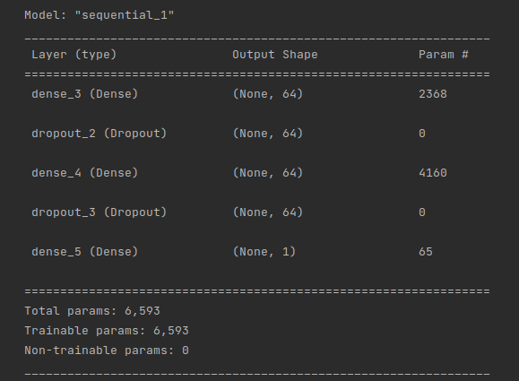
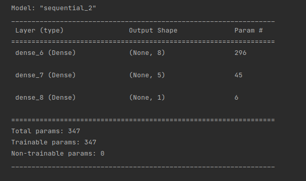

# Module 19

## Overview
In this analysis, we trained several neural networks on a funding data set. We also performed a variety of data preprocessing before fitting these models.

## Results
* Data preprocessing
  * The target for the model is whether the loan was successful (IS_SUCCESSFUL).
  * All other variables in the data set were features for our model. We dropped both the EIN and NAME features, as they have no predictive value in this exercise.
  * EIN and NAME are neither targets nor features, and should be removed from the input data
* Compiling, Training, and Evaluating the Model
  * I tried two different architectures:
    * Two dense layers with 64 neurons each, along with dropout between each layer
    * Two dense layers with 8 neurons in the first layer and 5 layers in the second layer, and no dropout
  * I tried the bigger network to see if adding more neurons would help. It turns out it did not help and the model performed very badly.
  * The simpler network was taken from examples given in the course. It performed much better.
  * I was unable to achieve the target model performence, both by trying new features and by trying a new architecture (and all combinations thereof)
  * Steps taken to improve model performance:
    * More neurons per layer
    * Different activation function (leaky relu instead of relu)
    * Adding dropout
    * Feature engineering - I converted the income amount feature to a numeric variable, instead of a categorical one, because the order of the feature values should be included in the model

See example images below of model summaries:

## Summary
Overall, the simpler model performed the best. Feature engineering did not seem to help much. Due to the small data involved, I'd recommend instead using a SVM classifier, as it has been shown to handle smaller data better.
